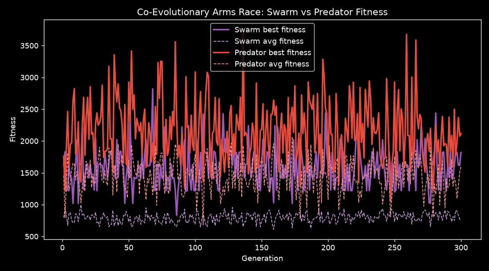
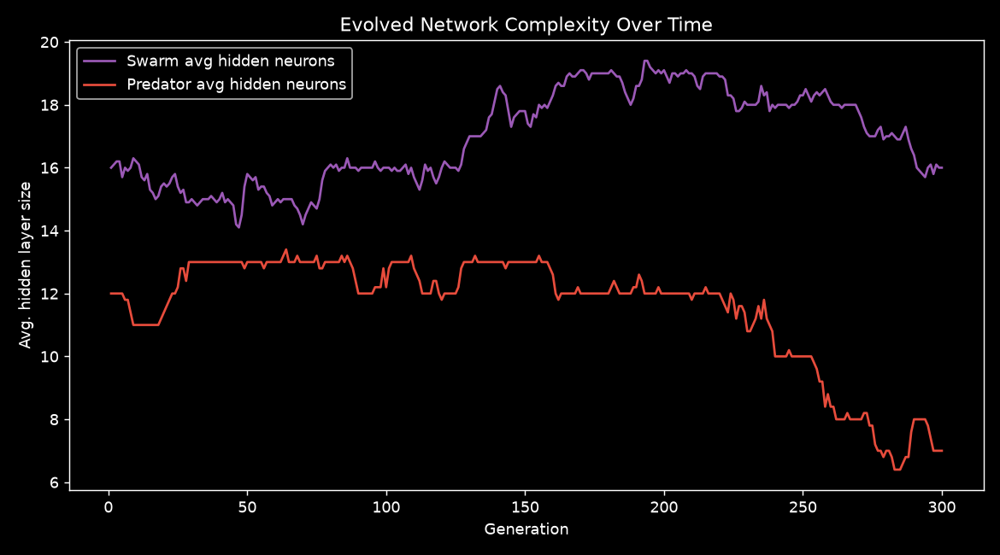
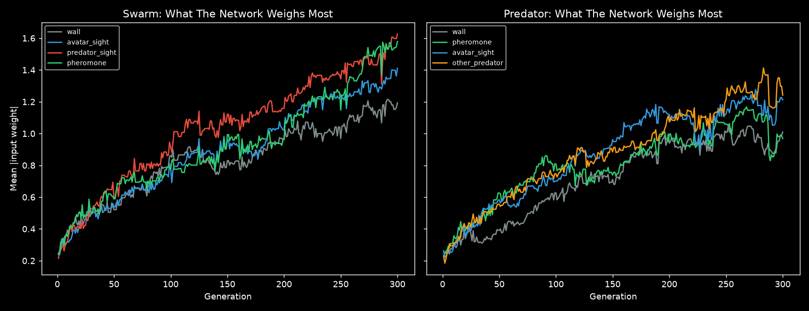
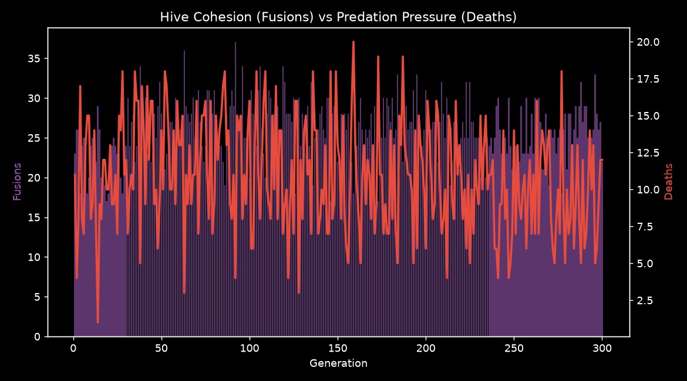
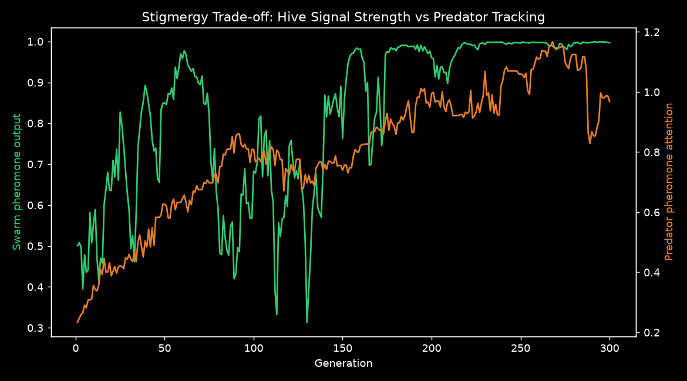
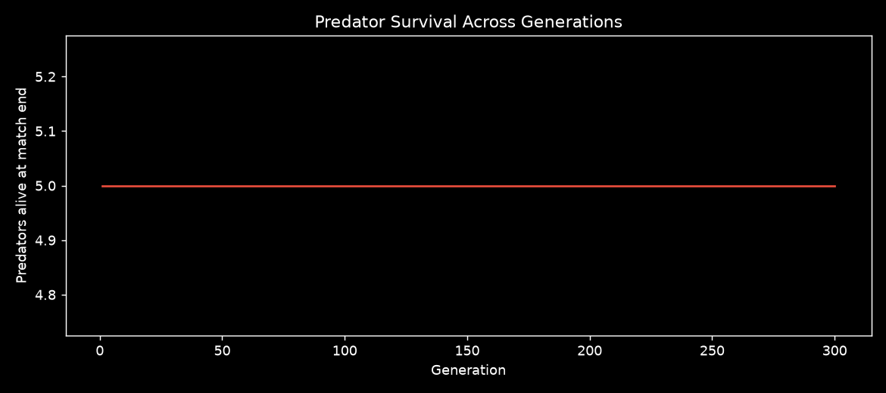

# Co-Evolutionary Hive vs Predator Simulation — Results Report

*Source log: `simulation_log_v2.json` — 300 generations*

## Abstract

This experiment evolves two competing neural populations inside a procedurally generated maze: a **swarm/hive** of avatars that fuse together for size-based survival and communicate via a learned pheromone field, and a **predator population** that hunts the swarm and co-evolves its own tactics in response. Both species use a population-based genetic algorithm with weight mutation, crossover, and NEAT-lite structural mutation (the hidden layer size itself can grow or shrink across generations).

## Methodology

**Environment.** A procedurally generated maze (randomized depth-first search plus a loop-adding pass to avoid single-path corridors) is regenerated every 15 generations to discourage maze-specific overfitting.

**Swarm learning.** 50 avatars are piloted by a population of 10 genomes (5 avatars per genome). Avatars perceive walls, other avatars, the predator, and a local pheromone gradient in 4 directions, plus their own fused size. Their 5th output controls how much pheromone they deposit — coordination is a *learned* behavior, not a hardcoded rule.

**Predator learning.** 5 predators are piloted by a population of 5 genomes (1 each), so every predator genome is evaluated every generation. Predators perceive walls, the pheromone field, direct sightlines to avatars, and nearby predators (to encourage spreading out rather than clumping).

**Evolution.** Both populations use tournament selection (k=3), uniform crossover, elitism (top 2 genomes carried over), Gaussian weight mutation, and an 8% chance per offspring of a structural mutation (hidden layer size ±1, clipped to [6, 32]).

**Fitness.** Swarm genomes are credited for fusions caused by their avatars, survival time, and a large bonus if one of their avatars grows big enough to kill a predator. Predator genomes are credited for kills, proximity-based pursuit shaping, and survival time.

## Results

### 1. The Arms Race

Over 300 generations, the swarm's best fitness moved by **+200** and the predator's best fitness moved by **+356**. Predators fully wiped from the maze (swarm total victory) occurred in **0** of 300 generations. If the two curves rise together, that's the signature of genuine co-evolution rather than one side simply solving the other.

### 2. Network Complexity (NEAT-lite)

Swarm network complexity changed by **+0.0** average hidden neurons; predator complexity changed by **-5.0**. Growth suggests evolution found value in representing more complex behavior; shrinkage suggests simpler reactive policies were sufficient (or that structural mutation drifted without strong pressure toward complexity).

### 3. What Each Species Learned to Pay Attention To

Each line tracks the average magnitude of input weights per perception channel in the best genome each generation — a proxy for what the network has learned matters. A rising `predator_sight` line for the swarm means avatars are learning to actively react to the predator rather than move randomly; a rising `pheromone` line for the predator means it's learning to track the hive's own coordination signal.

### 4. Hive Cohesion vs Predation Pressure

Average fusions per generation: **25.5**. Average deaths per generation: **10.8**. Fusion count is the swarm's main lever for creating a predator-killing giant; deaths are the predator's main lever for suppressing that strategy before it snowballs.

### 5. The Stigmergy Trade-off

Correlation between swarm pheromone output and predator attention to pheromone: **r = 0.66**. The pheromone channel is a double-edged sword for the swarm: strong signals help avatars find each other to fuse, but the same signal is exactly what predators can evolve to track. A positive correlation here is evidence the predator population is specifically adapting to exploit the swarm's own communication channel — real predator-prey signal exploitation, the same dynamic seen in real biological stigmergy/eavesdropping arms races.

### 6. Predator Survival

Tracks how many of the 5 predators were still alive at the end of each match — a direct measure of swarm dominance over time.

## Discussion

Unlike the v1 simulation (a single shared brain hill-climbing until the first predator kill, then exiting), this setup never 'finishes' — the swarm and predator are locked in a continuous arms race, which is the more realistic and more interesting regime for studying emergent multi-agent behavior. The pheromone/stigmergy mechanism in particular creates a genuinely open-ended tension: any coordination signal useful to the hive is also useful to something hunting the hive. Watching whether swarm pheromone output trends down over the run (evolving quieter, harder-to-track coordination) versus staying high (betting on fusing faster than the predator can capitalize on the signal) is one of the more interesting things to watch in longer runs.

## Limitations & Simplifications

- **NEAT-lite, not full NEAT**: only hidden layer *size* evolves, not arbitrary connection topology (no innovation numbers, no per-connection add/remove). Full NEAT would allow non-layered, sparse, or skip-connection architectures to emerge.
- **Credit assignment is heuristic**: when avatars fuse, the surviving avatar's genome gets all the credit; this is a reasonable approximation but not a rigorous multi-agent credit assignment scheme.
- **Single pheromone channel**: real ant-colony stigmergy often uses multiple chemical signals (food trail vs. danger trail); this simulation uses one learned scalar per cell.

## Suggested Next Experiments

1. Run for 500+ generations and watch whether the arms-race gap oscillates (predator-prey cycles) or one side runs away.
2. Add a second pheromone channel (e.g., a distinct 'danger' signal deposited on death) and see if the hive learns to separate 'gather here' from 'flee this area' signals.
3. Log per-genome lineage (parent IDs) to build a phylogenetic tree of which strategies dominated.
